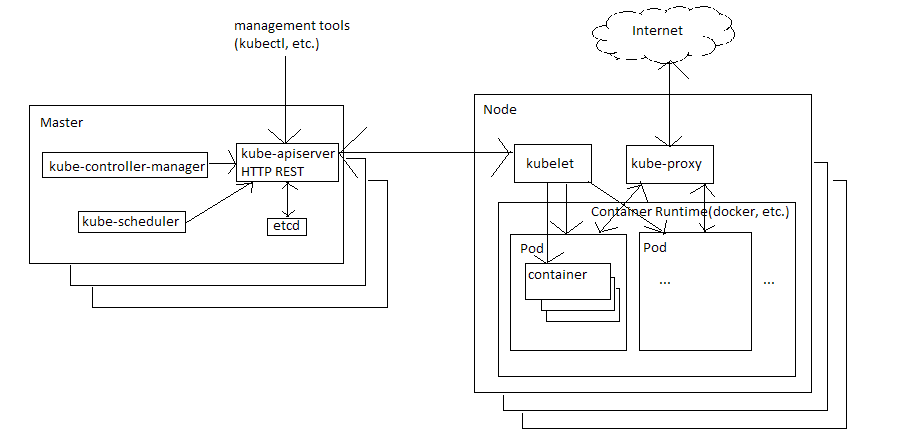

# Kubernetes报告

沈小洲 5142609052

## 概述

Kubernetes 由Google开发并在2014年开源，是一个跨主机集群的开源的容器调度平台，它可以自动化应用容器的部署、扩展和运维。
Kubernetes 提供了以容器为中心的基础架构。

## Kubernetes架构

### 组件

Kubernetes整体上主要由Master组件和多个Node组件组成，以Addon组件的形式提供更多的功能

#### Master

Master组件是整个集群的管理控制中心，运行在集群中的任意(方便起见通常在固定的)机器上，可以进行高可用布局。
Master组件进行关于全局决策，监测并相应集群事件。
Master组件提供多个服务，包含

- **kube-apiserver**
  提供用于操作kubernetes的api(以HTTP REST的形式)

- **kube-scheduler**
  为新建的未分配node的pod，根据各种预定的策略(参照独立性、集合资源需求、硬件软件约束等等因素)分配到一个node上运行

- **kube-controller-manager**
  运行并管理控制器。控制器对kubernetes中各种对象进行管理控制，包括
  - Node Controller 负责监控和处理结点宕机
  - Replication Controller 负责维护复制集中每个副本中的pod使之保持在一个合适的数量
  - Endpoints Controller 填充端点对象，即连接pods和services
  - ...

- **etcd**
  kubernetes的底层键值对数据库系统，用于存储所有的集群数据

#### Node

Node组件运行在集群中剩下的每一个机器(node)上，提供运行环境，并维持pods的运行。
Node组件提供如下服务

- **kubelet**
  运行在集群中每个node上的代理，监视并管理被分配到所在node的所有pods。
  kubelet根据给定的PodSpecs来确保pod中的容器健康的运行，向Master汇报每个pod的状态

- **kube-proxy**
  网络代理，维护网络规则，并在其上实现kubernetes的服务抽象

- **Container Runtime**
  容器运行时负责运行容器，kubernetes提供了多种容器支持，包括docker等

#### Addons

插件是以pods或services形式实现的集群功能，给整个系统功能提供了可扩展性

## 容器

容器技术在操作系统层面之上对不同的应用进行隔离，而非传统虚拟机技术在机器层面上进行隔离，容器技术有下述优点：
1. 每个容器相互隔离，不同容器中的应用不会相互影响，可以区分各自的计算资源
2. 容器更加轻量级，很容易构建容器镜像，可以更简单快速地部署
3. 与底层基础设施相解耦，便于在不同的云、机器、操作系统上进行移植
4. 统一了开发、测试、生产环境，保证应用在这些环境下运行的一致性
5. 容器镜像的构建在开发阶段完成，使得应用的开发与运维相解耦
6. 以容器为单位可以更容易构建分布式应用，也有助于建设微服务架构
7. 由于可以区分出每个容器的计算资源，可以进行整体的资源调度，提高资源的利用率

### Pod

Pod是Kubernetes中部署的最小的基本单位，封装了一个(有时候可以是多个)容器的抽象、存储资源、独立的一个网络ip、管理容器运行的策略选项。
一个Pod表示运行在集群上的一个应用的实例。

Pod的声明周期很短，是用后即焚的实体，创建后被分配到一个node上执行，由于进程中止、删除、缺少资源、node或者调度器故障等原因都会导致pod被删除。因此通常由Master组件中的一些controller来控制pod的创建、销毁等。

## Kubernetes的优点

1. 以容器为中心的基础架构。容器是一项新兴的技术，能解决行业中遇到的许多新的挑战。基于容器技术，Kubernetes有助于快速部署应用，同时带来很高的可移植性，可以方便地部署在实体机、虚拟机甚至各种云中。
2. 以pod为部署的基本单位，可以很好地支持应用的高可用(方便地部署应用多个实例)、可扩展(在单个pod内可以增加资源进行纵向扩展，而运行多个pod就可以进行横向扩展)。并且通过统一的资源分配控制，可以优化资源的使用，节约成本
3. 整个管理流程自动化，实现了自动部署、自动重启、自动复制、自动伸缩，可以方便地进行多实例部署，也可以无缝对接新的应用功能(运行新版本应用的pod，逐步删除旧版本应用的pod)
4. 很好地支持微服务架构
4. 提供了一套定义优秀的API，供使用者对系统的各个方面进行控制
5. 整个系统模块化(抽象为一系列各种类型的kubernetes对象)，插件化(Addon组件)，方便使用者在其基础上根据各自的业务需求，开发新的功能。同时项目也是完全开源的，便于开发者进行二次开发，也通过开源社区的帮助得到更好的发展空间

## Kubernetes的缺点

1. 在业务方面不提供中间件、数据处理框架、数据库等等服务(虽然在Kubernetes之上可以很好地构建这些PaaS系统)
2. 在应用开发方面不负责部署源码也不负责编译应用，使用者需要在其上搭建自己的CI/CD系统
3. 在运维方面也不提供机器的配置、维护、管理、自动修复等功能，这部分工作仍然需要基础设施的运维人员进行

## 个人总结

Kubernetes专注于应用的部署和实例的管理，是非常好的自动化运维工具，完成并透明化了将应用部署的机器上的过程中的种种细节。

虽然它向下不提供硬件的管理，向上不负责软件的开发、业务的组合，但是相较传统的开发和运维流程，基于Kubernetes，可以更容易地构建出高可用、高可扩展的分布式系统(应用、服务)。也正是这种高自由度，kubernetes轻松地适应各种环境、满足不同的业务需求，加上开源之后收到开源社区的帮助能够更健康的发展，被不同规模不同类型的企业采用也能受实际生产环境的检验。

总的来说kubernetes这套系统是非常优秀的，在发布后短短三四年间就受到了行业内所有人的瞩目。在开源社区、各个企业的开发人员的帮助下，Kubernetes以及基于Kubernetes的各种新的系统，将会推动行业新的变革。

## 参考资料

1. Kubernetes文档 - Kubernetes是什么？ [What is Kubernetes?](https://kubernetes.io/docs/concepts/overview/what-is-kubernetes/)
2. Kubernetes文档 - Kubernetes组件 [Kubernetes Components](https://kubernetes.io/docs/concepts/overview/components/)
